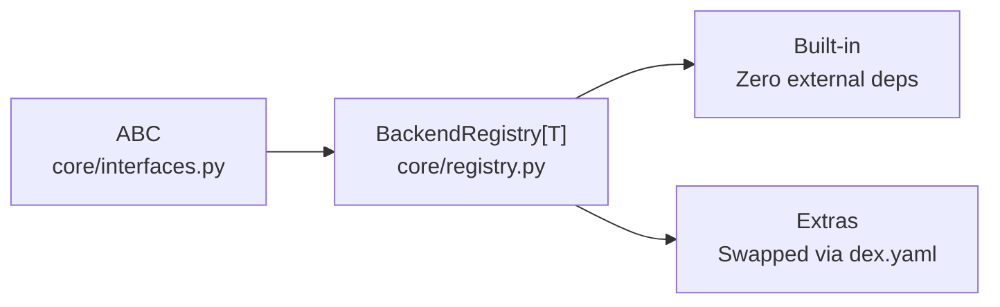
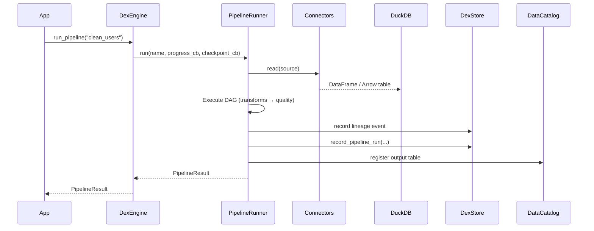
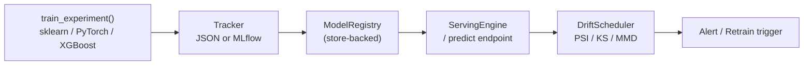
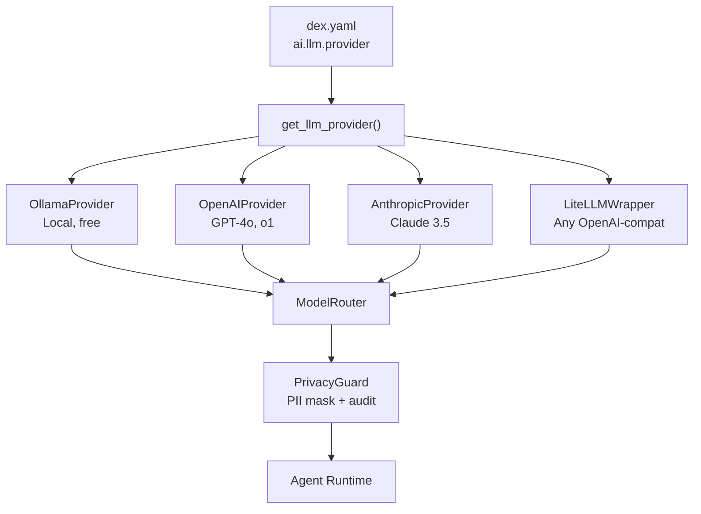
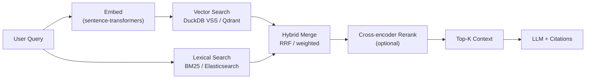
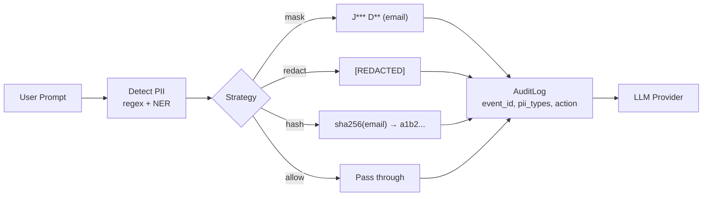

# DataEngineX Architecture

> **One config file. One library. Data + ML + AI unified.**

---

## Philosophy

```
┌─────────────────────────────────────────────────────────────────────┐
│  DataEngineX is a LIBRARY, not a platform.                          │
│                                                                     │
│  • No HTTP server bundled — you import it, you own the server      │
│  • One `dex.yaml` describes the entire project                      │
│  • Local-first: `pip install dataenginex` works offline            │
│  • Pluggable backends — swap DuckDB → Spark, SQLite → Postgres     │
│  • Pure Python 3.13+ • Zero required external services             │
└─────────────────────────────────────────────────────────────────────┘
```

---

## System Overview

```mermaid
graph TB
    subgraph UserApp["🧑‍💻 Your Application (FastAPI, CLI, Notebook, dex-studio)"]
        AppCode["import dataenginex\nengine = DexEngine('dex.yaml')"]
    end

    subgraph Config["⚙️ Config System"]
        YAML["dex.yaml"] --> EnvResolve["${ENV:-default}"]
        EnvResolve --> PydanticVal["Pydantic v2 Validation"]
        PydanticVal --> DexConfig["Typed DexConfig"]
    end

    subgraph Core["🔧 Core Runtime"]
        DexConfig --> DexEngine["DexEngine\nSingle entry point"]
        DexEngine --> DexStore["DexStore\nSQLite WAL • .dex/store.duckdb"]
        DexEngine --> PluginRegistry["PluginRegistry\nEntry-point + project plugins"]
    end

    subgraph DataLayer["📊 Data Layer"]
        DexEngine --> PipelineRunner["PipelineRunner\nDAG executor"]
        PipelineRunner --> Connectors["Connectors\nCSV/Parquet/DuckDB/REST/Kafka/SSE\n[Spark/dbt/Delta/Postgres]"]
        PipelineRunner --> Transforms["Transforms\nSQL • filter • derive • cast\n• dedup • aggregate • window"]
        PipelineRunner --> Quality["Quality Gates\nCompleteness • Uniqueness\nSchema • Freshness • Custom SQL"]
        PipelineRunner --> FeatureStore["FeatureStore\nOffline + Online serving"]
        DexEngine --> Lakehouse["Lakehouse\nBronze → Silver → Gold\nParquet + Delta Lake"]
        DexEngine --> Catalog["DataCatalog\nLineage + Metadata"]
    end

    subgraph MLLayer["🤖 ML Layer"]
        DexEngine --> Tracker["Tracker\nJSON • MLflow"]
        DexEngine --> Training["Training\nsklearn • PyTorch • XGBoost"]
        DexEngine --> Serving["ServingEngine\nBuilt-in predictor • A/B"]
        DexEngine --> Drift["Drift Detection\nPSI • KS • MMD"]
        DexEngine --> Registry["ModelRegistry\nStage: dev → staging → prod"]
    end

    subgraph AILayer["🧠 AI Layer"]
        DexEngine --> LLMProviders["LLM Providers\nOllama • OpenAI • Anthropic\nLiteLLM (any OpenAI-compat)"]
        LLMProviders --> Router["ModelRouter\nCost-aware • Fallback • Guardrails"]
        DexEngine --> VectorStore["VectorStore\nDuckDB VSS • Qdrant"]
        VectorStore --> Retrieval["Retrieval\nBM25 + Dense + Hybrid + Graph"]
        DexEngine --> Agents["Agent Runtime\nBuilt-in • ReAct • Plan-Execute\nTools: SQL, Search, Predict, Code"]
        DexEngine --> Memory["Memory\nShort-term • Long-term (SQLite)\nEpisodic (trajectories)"]
        DexEngine --> PrivacyGuard["PrivacyGuard\nPII detect → mask/redact/hash\nOutbound call audit"]
    end

    subgraph Observability["📈 Observability"]
        DexEngine --> StructLog["structlog\nJSON • pretty • key-value"]
        DexEngine --> Prometheus["Prometheus metrics\n/health • /metrics"]
        DexEngine --> AuditLog["AuditLog\nEvery action traceable"]
    end

    %% Persistence connections
    DexStore -.-> PipelineRunner
    DexStore -.-> Tracker
    DexStore -.-> Registry
    DexStore -.-> Memory
    DexStore -.-> Catalog
    DexStore -.-> AuditLog
    DexStore -.-> Quality

    style UserApp fill:#e8f5e9
    style Config fill:#fff3e0
    style Core fill:#e3f2fd
    style DataLayer fill:#f3e5f5
    style MLLayer fill:#e8eaf6
    style AILayer fill:#fce4ec
    style Observability fill:#f1f8e9
```



---

## Core Patterns

### 1. Backend Registry (The Universal Pattern)

Every subsystem follows the same plugin architecture:



```python
# dataenginex/core/registry.py
from dataenginex.core.registry import BackendRegistry
from dataenginex.core.interfaces import BaseConnector

connector_registry = BackendRegistry("connector")

@connector_registry.decorator("csv")
class CsvConnector(BaseConnector):
    ...

# In dex.yaml:
# data:
#   sources:
#     my_csv:
#       type: csv
#       path: data/users.csv
```

**Registered backends** (core + optional extras):

| Domain | Core (bundled) | Optional Extras |
|--------|---------------|-----------------|
| **Connectors** | CSV, Parquet, JSON, DuckDB, REST, HTTP, SSE, Kafka, RabbitMQ | PySpark `[data]`, dbt CLI `[data]`, Delta `[delta]`, PostgreSQL `[postgres]` |
| **ML Tracking** | JSON file-based | MLflow `[tracking]` |
| **Feature Store** | In-memory + SQLite | — |
| **Serving** | Built-in predictor | — |
| **Vector Store** | DuckDB VSS (in-memory) | Qdrant `[qdrant]` |
| **LLM** | Ollama, OpenAI, Anthropic | LiteLLM (pip install separately) |
| **Lexical Search** | — | Elasticsearch (built-in core dep) |
| **Queue** | — | ARQ + Redis `[queue]` |
| **Cloud Storage** | — | S3, GCS, BigQuery `[cloud]` |

---

### 2. DexEngine — The Single Entry Point

```python
from dataenginex.engine import DexEngine

engine = DexEngine("dex.yaml")        # Loads config, inits all backends
engine.run_pipeline("clean_users")    # Execute pipeline
models = engine.model_registry.list_models()
response = engine.agents["assistant"].chat("summarise the latest run")
engine.close()
```

**Initialisation sequence** (deterministic, dependency-ordered):

```
1. Load & validate dex.yaml → DexConfig (Pydantic v2, frozen)
2. Create .dex/ directory + DexStore (SQLite WAL)
3. Discover plugins (entry-points + project plugins/)
4. Initialise ML backends: tracker → feature_store → serving
5. Initialise vector store + embedder
6. Initialise PipelineRunner (gets feature_store + vector_store)
7. Initialise AI: LLM → tools → agents
8. Initialise PrivacyGuard (security primitive, always available)
9. Wire PrivacyGuard into ModelRouter for outbound LLM audit
10. Initialise AI layer: memory, episodic, sandbox, router
11. Auto-ingest lakehouse tables into vector store (background)
```

---

### 3. DexStore — Unified Persistence

**Single SQLite file (WAL mode) at `.dex/store.duckdb`** replaces all JSON state files.

```sql
-- Tables (auto-created on init)
pipeline_runs      -- execution history, duration, rows, errors
lineage_events     -- DAG: parent_id, layer, source→dest, counts
model_artifacts    -- name, version, stage, metrics, params, path
quality_runs       -- timestamped quality check results
audit_log          -- actor, action, resource, status, IP, details
ai_memory          -- long-term agent memory (content, role, metadata)
ai_episodes        -- episodic trajectories (task, steps, reward)
catalog_entries    -- lakehouse datasets: name, layer, format, location, schema
```

**Why SQLite WAL over DuckDB for metadata?**
- Multiple processes (CLI + dex-studio web server) can read/write concurrently
- WAL = N readers + 1 writer with retries, no `SQLITE_BUSY` crashes
- Thread-local connections = no shared-state races
- DuckDB file lock blocks second process entirely

---

### 4. Config System — `dex.yaml` → Typed `DexConfig`

```yaml
# Minimal valid config
project:
  name: my-project

# Everything else has sensible defaults
data:
  engine: duckdb
  sources: {}
  pipelines: {}

ml:
  tracker: json
  features: { backend: memory }
  serving: { engine: builtin }

ai:
  llm: { provider: ollama, model: llama3.1 }
  retrieval: { strategy: hybrid }
  vectorstore: { backend: duckdb }
```

**Features:**
- **Env interpolation**: `${VAR:-default}` in any string field
- **Overlay layering**: `dex.yaml` + `dex.prod.yaml` → deep merge
- **Cross-ref validation**: pipeline sources must exist, depends_on must exist
- **Only `project.name` required** — progressive disclosure

---

## Data Layer Deep Dive

### Pipeline Execution



**Transform types** (all run in DuckDB, vectorised):
| Type | SQL Equivalent |
|------|----------------|
| `filter` | `WHERE condition` |
| `derive` | `SELECT *, expr AS name` |
| `cast` | `CAST(col AS type)` |
| `rename` | `RENAME COLUMN` |
| `drop_columns` | `DROP COLUMN` |
| `fill_null` | `COALESCE(col, default)` |
| `deduplicate` | `ROW_NUMBER() OVER (PARTITION BY key)` |
| `aggregate` | `GROUP BY ... AGG(expr)` |
| `window` | `FUNCTION() OVER (PARTITION BY ... ORDER BY ...)` |
| `sql` | Raw DuckDB SQL (full power) |

**Quality gates** (post-transform, pre-destination):
```yaml
quality:
  completeness: 0.95           # min non-null ratio
  uniqueness: [user_id, email] # columns that must be unique
  row_count_min: 1000          # minimum rows
  freshness_hours: 24          # max age of latest partition
  custom_sql: "SELECT COUNT(*) FROM _qc WHERE revenue < 0"
```

---

### Lakehouse — Bronze / Silver / Gold

```
.dex/lakehouse/
├── bronze/      # Raw landings (immutable, partitioned by ingestion_time)
├── silver/      # Cleaned, typed, deduplicated
└── gold/        # Business-ready, aggregated, ML features
```

**Formats**: Parquet (default) or Delta Lake (`[delta]` extra)
- Delta gives ACID, time travel, schema evolution
- Both registered in `DataCatalog` with schema, row counts, lineage

---

## ML Layer Deep Dive

### Training → Registry → Serving → Drift



**Model lifecycle stages:** `development → staging → production → archived`

```python
# Training
engine.run_experiment("churn_model", {"model_type": "xgboost", "target": "churn"})

# Registry (auto-populated from tracker)
engine.model_registry.list_models()
engine.model_registry.promote("churn_model", "v3", "production")

# Serving
engine.serving_engine.predict("churn_model", {"features": {...}})

# Drift (scheduled via croniter in dex.yaml)
engine.drift_scheduler.check("churn_model")
```

---

## AI Layer Deep Dive

### LLM Provider Abstraction



**Router capabilities:**
- Cost-aware routing (cheapest model that meets quality threshold)
- Automatic fallback on error/timeout
- Per-request model override via agent config
- PrivacyGuard wrapping — every outbound call audited & PII-masked

---

### Retrieval Pipeline



**Strategies:** `vector` | `lexical` | `hybrid` | `graph` (knowledge graph walk)

---

### Agent Runtime

```python
# Built-in agents (register in dex.yaml)
ai:
  agents:
    analyst:
      runtime: builtin
      system_prompt: "You are a data analyst. Use SQL tool."
    coder:
      runtime: builtin
      system_prompt: "Write Python to answer data questions."

# Custom agent
from dataenginex.ai.agents import BaseAgent

class MyAgent(BaseAgent):
    async def run(self, task: str) -> AgentResult:
        ...
```

**Available tools (auto-registered):**
- `query` — SQL over lakehouse (DuckDB)
- `search_similar` — vector search
- `search_lexical` — BM25/Elasticsearch
- `predict` — ML model inference
- `python` — sandboxed code execution
- `get_lineage` — data lineage graph
- `get_quality` — quality scores

---

### Memory System

| Type | Backend | TTL | Use Case |
|------|---------|-----|----------|
| Short-term | In-memory (deque) | Session | Conversation context |
| Long-term | SQLite (`ai_memory` table) | Forever | Facts, preferences, summaries |
| Episodic | SQLite (`ai_episodes` table) | Forever | Full trajectories for few-shot / RL |

---

## Security — PrivacyGuard

**Built-in, zero-config PII protection for every outbound LLM call.**



**Configured in `dex.yaml`:**
```yaml
secops:
  guard:
    enabled: true
    default_strategy: mask
    entities: [PERSON, EMAIL, PHONE, SSN, CREDIT_CARD, IP_ADDRESS]
    custom_patterns:
      - name: api_key
        regex: "sk-[a-zA-Z0-9]{32,}"
        strategy: redact
  audit:
    enabled: true
    db_path: ".dex/audit.duckdb"
```

---

## Observability Stack

| Component | Tech | Endpoint |
|-----------|------|----------|
| **Structured logging** | structlog | stdout / file (JSON, key-value, pretty) |
| **Metrics** | prometheus-client | `GET /metrics` (via your FastAPI) |
| **Health** | Custom | `GET /health` → component status |
| **Audit trail** | SQLite (DexStore) | Query via `engine.store.all_events` |
| **AI costs** | Built-in tracker | `engine.ai_metrics.summary()` |

**Minimal FastAPI integration (in your app):**
```python
from fastapi import FastAPI
from dataenginex.api.schemas import HealthResponse
from dataenginex.middleware.metrics import metrics_middleware

app = FastAPI()
app.middleware("http")(metrics_middleware)

@app.get("/health", response_model=HealthResponse)
def health():
    return engine.health()

@app.get("/metrics")
def metrics():
    return Response(content=generate_latest(), media_type=CONTENT_TYPE_LATEST)
```

---

## Deployment Architecture

```
┌─────────────────────────────────────────────────────────────────┐
│                        YOUR INFRASTRUCTURE                       │
├─────────────────────────────────────────────────────────────────┤
│                                                                  │
│  ┌─────────────┐    ┌─────────────┐    ┌─────────────┐          │
│  │  dex-studio │    │  Your API   │    │  Cron /     │          │
│  │  (FastAPI)  │    │  (FastAPI)  │    │  Scheduler  │          │
│  └──────┬──────┘    └──────┬──────┘    └──────┬──────┘          │
│         │                  │                  │                  │
│         └──────────────────┼──────────────────┘                  │
│                            ▼                                     │
│                   ┌─────────────────┐                            │
│                   │  dataenginex    │  ← Single library import  │
│                   │  DexEngine      │                            │
│                   └────────┬────────┘                            │
│                            │                                     │
│         ┌──────────────────┼──────────────────┐                  │
│         ▼                  ▼                  ▼                  │
│  ┌─────────────┐    ┌─────────────┐    ┌─────────────┐          │
│  │  .dex/      │    │  Lakehouse  │    │  External   │          │
│  │  store.duckdb│    │  (Parquet/  │    │  Services   │          │
│  │  audit.duckdb│    │   Delta)    │    │  (LLM, DB,  │          │
│  └─────────────┘    └─────────────┘    │   Queue)    │          │
│                                         └─────────────┘          │
└─────────────────────────────────────────────────────────────────┘
```

**Kubernetes (via infradex):**
```yaml
# ArgoCD Application
apiVersion: argoproj.io/v1alpha1
kind: Application
metadata:
  name: dataenginex
spec:
  source:
    repoURL: https://github.com/TheDataEngineX/infradex
    path: charts/dataenginex
  destination:
    server: https://kubernetes.default.svc
    namespace: dataenginex
```

---

## Project Structure

```
src/dataenginex/
├── cli/              # `dex` CLI: validate, version, init
├── config/           # Schema, loader, env resolution, defaults
├── core/             # ABCs, Registry, Exceptions, Retry, CircuitBreaker
├── engine.py         # DexEngine — single entry point
├── store.py          # DexStore — SQLite WAL persistence
├── api/              # HTTP helpers: errors, schemas, pagination (NO server)
├── data/
│   ├── connectors/   # CSV, Parquet, DuckDB, REST, Kafka, SSE, HTTP
│   ├── pipeline/     # Runner, DAG, transforms, quality, profiler
│   ├── quality/      # Gates, Spark quality
│   └── transforms/   # SQL, filter, derive, cast, etc.
├── ml/
│   ├── tracking/     # JSON + MLflow backends
│   ├── features/     # Feature store (offline + online)
│   ├── serving_engine/  # Built-in predictor
│   ├── registry.py   # ModelRegistry (store-backed)
│   ├── training.py   # sklearn / PyTorch / XGBoost
│   ├── drift.py      # PSI, KS, MMD detection
│   └── mlflow_registry.py
├── ai/
│   ├── agents/       # Built-in + custom agent runtime
│   ├── llm.py        # Provider abstraction + factory
│   ├── retrieval/    # Vector + lexical + hybrid + graph
│   ├── routing/      # ModelRouter, cost-aware, fallback
│   ├── vectorstore.py  # DuckDB VSS + Qdrant
│   ├── memory/       # Short + long + episodic
│   ├── workflows/    # DAG, human-in-loop, conditions
│   ├── runtime/      # Sandbox, executor, checkpoint
│   ├── observability/  # Cost tracking, audit metrics
│   └── tools/        # Built-in tools registry
├── orchestration/
│   ├── scheduler.py  # croniter-based drift/pipeline scheduler
│   └── queue/        # ARQ background jobs
├── lakehouse/
│   ├── storage.py    # Parquet + Delta backends
│   ├── catalog.py    # DataCatalog (lineage + metadata)
│   └── partitioning.py
├── warehouse/
│   ├── transforms.py # SQL transform definitions
│   └── lineage.py    # Column-level lineage
├── secops/
│   ├── guard.py      # PrivacyGuard — PII detect/mask
│   ├── masking.py    # Strategies: mask, redact, hash, allow
│   ├── pii.py        # Regex + NER detectors
│   └── audit.py      # Outbound call audit logger
├── middleware/
│   ├── logging_config.py  # structlog setup
│   ├── metrics.py     # Prometheus middleware
│   └── domain_metrics.py
├── plugins/
│   └── registry.py   # Entry-point + project plugin discovery
└── orm/              # SQLAlchemy models (optional, for Postgres)
```

---

## Dependency Graph (Core → Extras)

```mermaid
graph TD
    Core["Core deps (always installed)"]
    Core --> Pydantic["pydantic>=2.13"]
    Core --> PydanticSettings["pydantic-settings>=2.14"]
    Core --> DuckDB["duckdb>=1.5"]
    Core --> PyArrow["pyarrow>=24.0"]
    Core --> StructLog["structlog>=26.1"]
    Core --> Click["click>=8.4"]
    Core --> Croniter["croniter>=6.2"]
    Core --> HTTPX["httpx>=0.28"]
    Core --> PromClient["prometheus-client>=0.25"]
    Core --> ORJSON["orjson>=3.11"]
    Core --> Kafka["confluent-kafka>=2.15"]
    Core --> Pika["pika>=1.4"]
    Core --> Strawberry["strawberry-graphql>=0.322"]
    Core --> SQLAlchemy["sqlalchemy>=2.0"]
    Core --> Elasticsearch["elasticsearch>=9.4"]
    Core --> PyYAML["pyyaml>=6.0"]

    Extras["Optional extras (pip install 'dataenginex[extra]')"]
    Extras --> Cloud["[cloud] boto3, google-cloud-storage, google-cloud-bigquery"]
    Extras --> Postgres["[postgres] asyncpg"]
    Extras --> Qdrant["[qdrant] qdrant-client"]
    Extras --> Queue["[queue] arq + redis"]
    Extras --> Delta["[delta] deltalake"]
    Extras --> PyTorch["[pytorch] torch"]
    Extras --> Data["[data] pyspark"]
    Extras --> ML["[ml] scikit-learn, sentence-transformers"]
    Extras --> Tracking["[tracking] mlflow"]
    Extras --> Notebook["[notebook] pandas"]
```



---

## Version & Compatibility Matrix

| Component | Version | Python |
|-----------|---------|--------|
| **dataenginex** | 0.5.x | 3.13+ |
| **Pydantic** | 2.13+ | 3.13+ |
| **DuckDB** | 1.5+ | 3.13+ |
| **PyArrow** | 24.0+ | 3.13+ |
| **structlog** | 26.1+ | 3.13+ |

**Test status (0.5.x):**
- 1250 passed, 35 skipped
- Coverage: 84% (optional deps excluded)
- `mypy --strict`: clean
- `ruff`: clean

---

## Design Decisions (ADR-style)

| Decision | Rationale |
|----------|-----------|
| **Library, not server** | User owns deployment, auth, scaling. No "platform lock-in". |
| **SQLite WAL for metadata** | Multi-process safe (CLI + web), no external DB required. |
| **DuckDB for compute** | Embedded, vectorised, Parquet-native, zero config. |
| **Pydantic v2 frozen models** | Config immutability prevents accidental mutation bugs. |
| **BackendRegistry pattern** | One pattern for all pluggable subsystems — learn once, use everywhere. |
| **Optional extras via `[extra]`** | Base install ~50MB; pay only for what you use. |
| **PrivacyGuard as primitive** | Security at the boundary, not bolted on later. |
| **No ORM for core** | SQLite + dataclasses = simple, fast, no migration pain. |

---

## Extending DataEngineX

### Add a Custom Connector
```python
# my_project/plugins/my_connector.py
from dataenginex.core.interfaces import BaseConnector
from dataenginex.core.registry import connector_registry

@connector_registry.decorator("my_api")
class MyAPIConnector(BaseConnector):
    def read(self, config) -> "pa.Table":
        # Return PyArrow table
        ...
    def write(self, table: "pa.Table", config) -> None:
        ...

# In dex.yaml:
# data:
#   sources:
#     my_data:
#       type: my_api
#       connection: { api_key: "${MY_API_KEY}" }
```

### Add a Custom Agent Runtime
```python
# my_project/plugins/my_runtime.py
from dataenginex.ai.agents import BaseAgent, agent_registry

@agent_registry.decorator("my_runtime")
class MyAgent(BaseAgent):
    async def run(self, task: str) -> AgentResult:
        ...
```

### Project Plugins (auto-discovered)
Place any `plugins/*.py` in your project root — `DexEngine` loads them before initialising subsystems.

---

## Related Docs

| Doc | Description |
|-----|-------------|
| [Quickstart](quickstart.md) | 5-minute tutorial |
| [Config Reference](../api-reference/config.md) | Full `dex.yaml` schema |
| [API Reference](../api-reference/index.md) | Module-by-module reference |
| [Development](development.md) | Contributing, testing, releasing |
| [Security](security-scanning.md) | Dependency scanning, supply chain |

---

*Architecture version: 0.5.x | Updated: 2026-07-20*