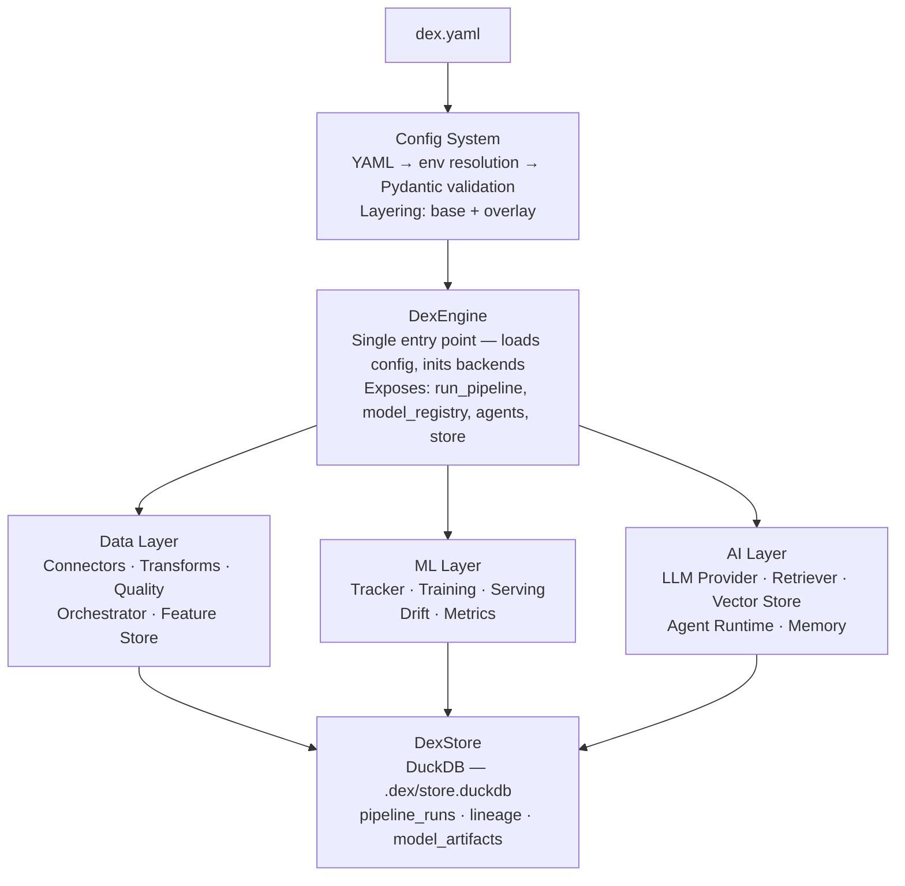
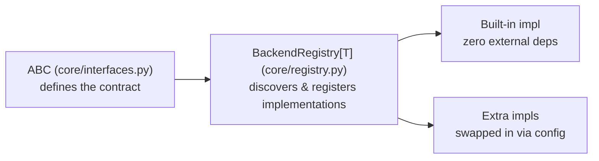

# DataEngineX Architecture

## Overview

**DataEngineX** is a unified Data + ML + AI **library** that wires industry tools through a
single config-driven interface. One `dex.yaml` defines the entire project.

**Design principle:** Pure Python library — no HTTP server bundled. Your application (DataEngineX Studio,
your own FastAPI/Flask app, a script) imports `dataenginex` and owns the server layer.

## Architecture



## Core Patterns

### Backend Registry

Every subsystem follows the same pattern:



```python
from dataenginex.core.registry import BackendRegistry
from dataenginex.core.interfaces import BaseConnector

connector_registry: BackendRegistry[BaseConnector] = BackendRegistry("connector")

@connector_registry.decorator("csv")
class CsvConnector(BaseConnector):
    ...
```

### DexEngine — Application Entry Point

`DexEngine` is the single object applications instantiate. It:

- Loads and validates `dex.yaml`
- Initialises `DexStore` (creates `.dex/store.duckdb` next to the config file)
- Registers data sources, pipelines, ML trackers, AI providers, agents
- Exposes domain methods: `run_pipeline`, `source_schema`, `warehouse_layers`, etc.

```python
from dataenginex.engine import DexEngine

engine = DexEngine("dex.yaml")
engine.run_pipeline("clean_users")
```

### DexStore — Persistence

Single DuckDB file at `.dex/store.duckdb` (project-local, next to `dex.yaml`).
Tables: `pipeline_runs`, `lineage_events`, `model_artifacts`, `quality_runs`,
`audit_log`, `ai_memory`, `ai_episodes`, `catalog_entries`.

### Config System

- Single `dex.yaml` → Pydantic validation → typed `DexConfig`
- Env var interpolation: `${VAR:-default}`
- Overlay layering: `dex.yaml` + `dex.prod.yaml`
- Cross-reference validation (pipeline sources, dependencies)
- Only `project.name` is required; everything else has defaults

### Exception Hierarchy

```
DataEngineXError
├── ConfigError → ConfigValidationError
├── PipelineError → PipelineStepError
├── RegistryError
└── BackendNotInstalledError
```

## Module Map

| Module | Purpose |
| ------------------ | -------------------------------------------------------------------------------------------------------------------------------------------- |
| `engine.py` | `DexEngine` — application entry point |
| `store.py` | `DexStore` — DuckDB persistence layer |
| `config/` | Schema, loader, env resolution |
| `core/` | ABCs, registry, exceptions |
| `cli/` | `dex` CLI (validate, version, init) |
| `api/` | HTTP helpers: error types, response models |
| `data/connectors/` | Built-in: CSV, Parquet, DuckDB, REST, Kafka, SSE, HTTP | Optional: Spark, dbt (`[data]`), Delta (`[delta]`), PostgreSQL (`[postgres]`) |
| `data/pipeline/` | Pipeline runner, transforms, quality, profiler |
| `ml/` | Classical ML: training, registry, serving, drift, **feature engines**, **mlflow registry** |
| `ai/` | LLM, agents, RAG, vectorstore, memory, observability |
| `orchestration/` | DriftScheduler, background tasks |
| `middleware/` | structlog config, Prometheus metrics |
| `lakehouse/` | Storage backends, catalog, partitioning |
| `warehouse/` | SQL transforms, lineage |
| `secops/` | **PrivacyGuard** — PII detection, masking strategies, outbound-call audit |
| `plugins/` | Entry-point discovery |

## Tech Stack

| Component | Built-in | Extra |
| ----------------- | ------------------------------------------------- | ------------------------------------------------------------------------------------------------------------ |
| Data Engine | DuckDB | PySpark / dbt CLI (`[data]`) |
| Orchestration | croniter scheduler | — |
| ML Tracking | JSON-based | MLflow (`[tracking]`) |
| Model Serving | Built-in predictor | — |
| LLM Provider | Ollama, OpenAI, Anthropic | LiteLLM (install separately) |
| Vector Store | DuckDB VSS | Qdrant (`[qdrant]`) |
| Retrieval | BM25 + Dense + Hybrid | — |
| Persistence | DuckDB | S3/GCS/BigQuery (`[cloud]`) |
| Logging | structlog | — |
| Config | Pydantic + YAML | — |
| CLI | Click | — |
| Privacy / Audit | PrivacyGuard — PII masking + audit | — |
| LLM Observability | AI observability audit + cost tracking | Langfuse (manual) |
| Cloud Storage | — | S3/GCS/BigQuery (`[cloud]`) |
| Connectors | CSV, Parquet, DuckDB, SSE, HTTP (REST, SSE), JSON | Spark, dbt, Delta Lake (`[delta]`), PostgreSQL (`[postgres]`), Qdrant (`[qdrant]`) |
| ML | Basic | PyTorch (`[pytorch]`), scikit-learn (`[ml]`), sentence-transformers (`[ml]`), MLflow (`[ml]` + `[tracking]`) |

## Coverage Strategy

**Current Coverage**: 84% (meets 80% threshold)

**Why Coverage is Not 100%**: Optional dependency files are excluded from coverage to keep CI fast. Tests for these run only when the optional extras are installed.

**To install optional dependencies and achieve >90% coverage**:

```bash
uv sync --all-extras
uv run poe test-cov
```

## Ecosystem

- **Docs:** `docs.thedataenginex.org`
