# DataEngineX Architecture Documentation

Welcome to the architecture documentation for **DataEngineX** — a unified Data + ML + AI library.

## Quick Links

| Document | Description |
|----------|-------------|
| [Architecture Overview](architecture.md) | System design, patterns, module map, deployment |
| [Visual Diagrams](architecture.mmd) | Mermaid source for all architecture diagrams |

---

## Architecture at a Glance

```mermaid
graph TB
    YAML["dex.yaml"] --> Config["Config System<br/>Pydantic v2 + Env"]
    Config --> Engine["DexEngine<br/>Single Entry Point"]
    Engine --> Store["DexStore<br/>SQLite WAL"]
    Engine --> Plugins["PluginRegistry"]

    Engine --> Data["📊 Data Layer"]
    Data --> Connectors["Connectors<br/>CSV/Parquet/REST/Kafka/Spark/Delta/PG"]
    Data --> Pipeline["PipelineRunner<br/>DAG + Transforms + Quality"]
    Data --> Lakehouse["Lakehouse<br/>Bronze → Silver → Gold"]
    Data --> Catalog["DataCatalog<br/>Lineage + Metadata"]

    Engine --> ML["🤖 ML Layer"]
    ML --> Tracker["Tracker<br/>JSON / MLflow"]
    ML --> Training["Training<br/>sklearn / PyTorch / XGBoost"]
    ML --> Serving["ServingEngine<br/>Predictor + A/B"]
    ML --> Registry["ModelRegistry<br/>dev → staging → prod"]
    ML --> Drift["Drift Detection<br/>PSI / KS / MMD"]
    ML --> Features["FeatureStore<br/>Offline + Online"]

    Engine --> AI["🧠 AI Layer"]
    AI --> LLM["LLM Providers<br/>Ollama / OpenAI / Anthropic / LiteLLM"]
    AI --> Router["ModelRouter<br/>Cost / Fallback / Guardrails"]
    AI --> Vector["Vector Store<br/>DuckDB VSS / Qdrant"]
    AI --> Retrieval["Retrieval<br/>BM25 + Dense + Hybrid + Graph"]
    AI --> Agents["Agent Runtime<br/>Built-in / ReAct / Plan-Execute"]
    AI --> Tools["Tools<br/>SQL / Search / Predict / Code"]
    AI --> Memory["Memory<br/>Short / Long / Episodic"]
    AI --> Privacy["PrivacyGuard<br/>PII + Audit"]

    Engine --> Obs["📈 Observability"]
    Obs --> Logs["structlog"]
    Obs --> Metrics["Prometheus"]
    Obs --> Audit["AuditLog"]

    Store -.-> Data
    Store -.-> ML
    Store -.-> AI
    Store -.-> Obs
```



---

## Core Principles

| Principle | Implementation |
|-----------|----------------|
| **Library, not server** | Import `DexEngine`, own your HTTP layer |
| **Config-driven** | Single `dex.yaml` → typed `DexConfig` |
| **Pluggable backends** | `BackendRegistry[T]` pattern for all subsystems |
| **Local-first** | `pip install dataenginex` works offline |
| **Immutable config** | Frozen Pydantic models, `model_copy(update=...)` |
| **Multi-process safe** | SQLite WAL for metadata |
| **Security primitive** | PrivacyGuard wraps every LLM call |

---

## Subsystems

### Data Layer
- **Connectors**: CSV, Parquet, JSON, DuckDB, REST, SSE, HTTP, Kafka, RabbitMQ, Elasticsearch, GraphQL
- **Transforms**: filter, derive, cast, rename, drop, fill_null, deduplicate, aggregate, window, SQL
- **Quality Gates**: completeness, uniqueness, row_count, freshness, custom SQL
- **Lakehouse**: Bronze/Silver/Gold (Parquet + Delta Lake)
- **Catalog**: Lineage, schema, ownership, tags

### ML Layer
- **Tracking**: JSON (built-in) or MLflow
- **Training**: sklearn, PyTorch, XGBoost via unified API
- **Serving**: Built-in predictor with A/B, canary, shadow
- **Registry**: Model lifecycle (dev → staging → prod → archived)
- **Drift**: PSI, KS, MMD with scheduled checks
- **Features**: Offline (lakehouse) + Online (Redis/SQLite)

### AI Layer
- **LLM Providers**: Ollama (local), OpenAI, Anthropic, LiteLLM (any OpenAI-compat)
- **Routing**: Cost-aware, fallback chains, privacy guard integration
- **Vector Store**: DuckDB VSS (built-in), Qdrant (extra)
- **Retrieval**: BM25 + dense + hybrid (RRF) + knowledge graph walk
- **Agents**: Built-in (ReAct, Plan-Execute), custom runtimes
- **Tools**: SQL, vector search, lexical search, predict, code sandbox, lineage, quality
- **Memory**: Short-term (deque), long-term (SQLite), episodic (trajectories)
- **PrivacyGuard**: PII detection (regex + NER) → mask/redact/hash/block + audit log

---

## Getting Started

```bash
pip install dataenginex
# or with extras:
pip install "dataenginex[ml,tracking,qdrant]"
```

```python
from dataenginex.engine import DexEngine

engine = DexEngine("dex.yaml")
engine.run_pipeline("etl")
result = engine.agents["analyst"].chat("Show me last week's revenue by channel")
```

See [Quickstart](../quickstart.md) for full tutorial.

---

## Contributing

Architecture changes are proposed via issues and PRs.

---

## Related Repos

| Repo | Purpose |
|------|---------|
| [dataenginex](https://github.com/TheDataEngineX/dataenginex) | This library |
| [dex-studio](https://github.com/TheDataEngineX/dex-studio) | Web UI (FastAPI + HTMX) |
| [infradex](https://github.com/TheDataEngineX/infradex) | K8s deployment (ArgoCD + Helm) |

---

*Architecture version: 0.5.x | Updated: 2026-07-20*